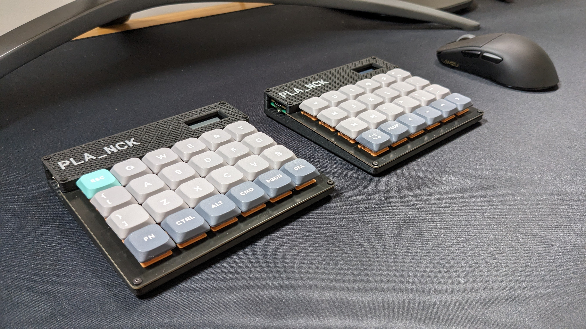
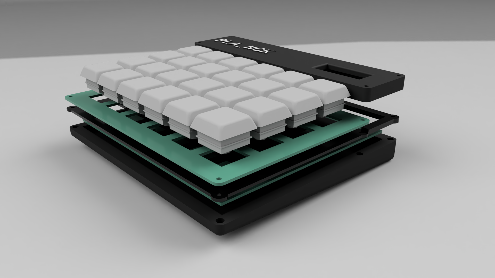
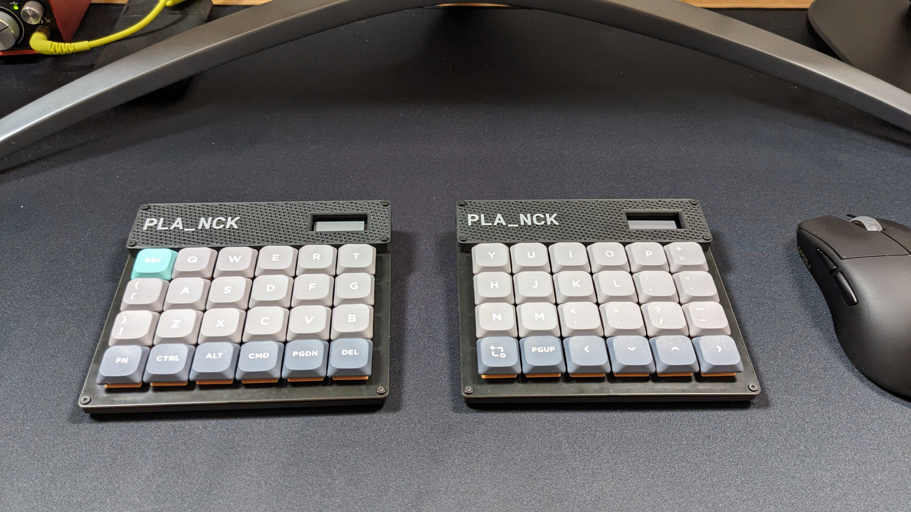
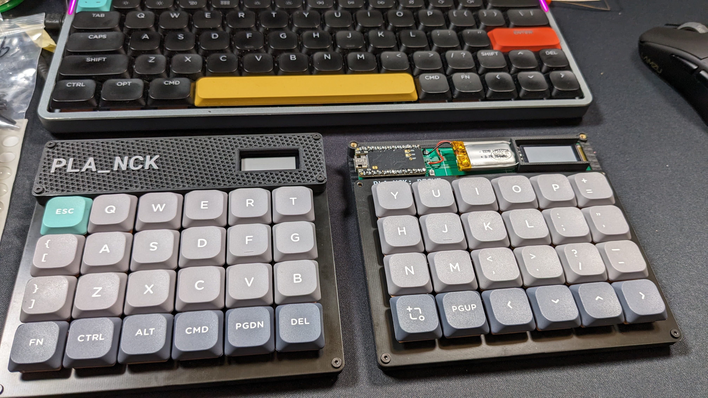
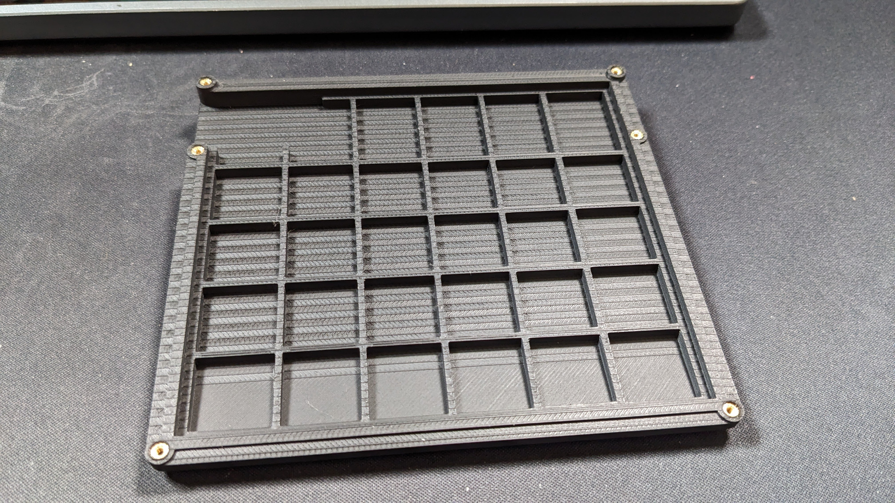
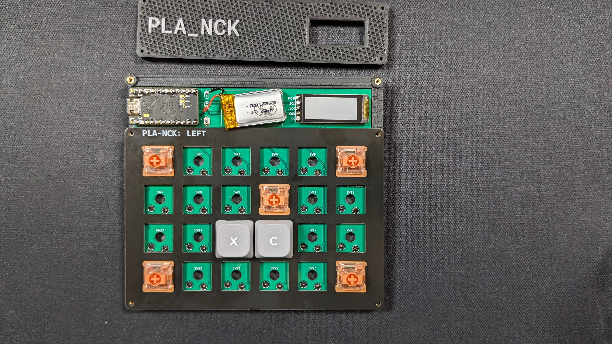
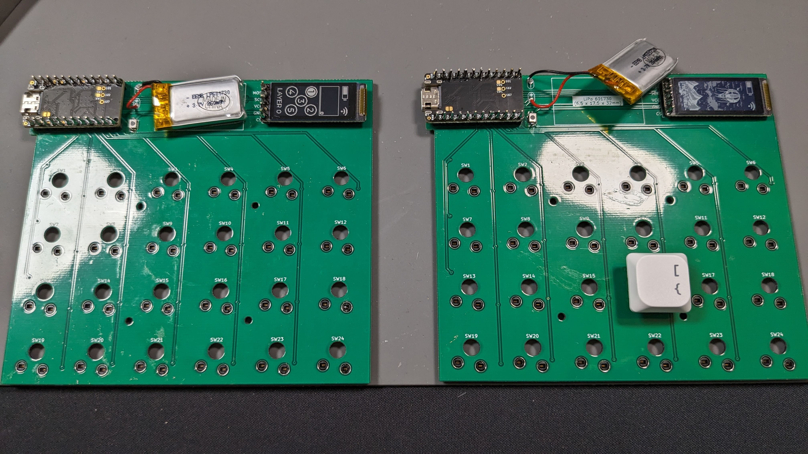
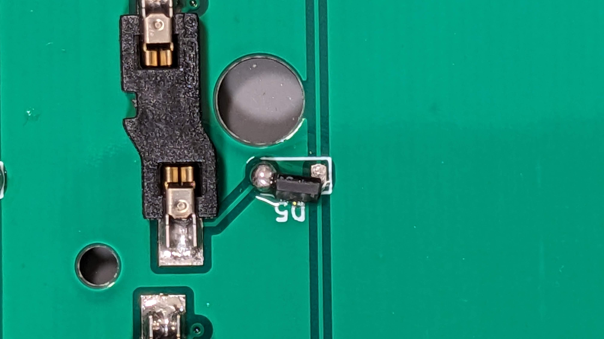
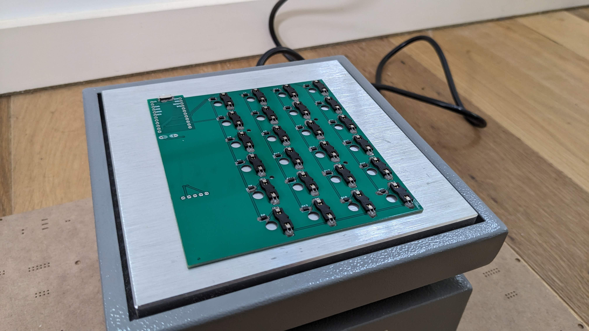
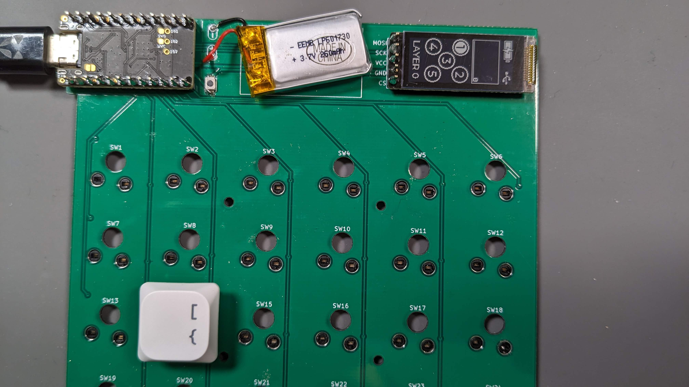

# PLA_NCK

A low profile split keyboard I built using Gateron KS-33 low profile switches.

## Story

I had assembled a Ferris Sweep previously but I hated the Kailh Low Profile Choc Switches but but wanted something low profile.
Sincve I couldn't find anything at the time I decided to learn KiCad and Fusion360 to create my own design.

I've called it the PLA_NCK because my original intention was to create a split [ZSA Planck EZ](https://blog.zsa.io/2307-goodbye-planck-ez/) (discontinued) since it has probably been my favourite layout to date. I justed wanted a split, bluetooth and low profile version with Gateron KS-33 switches after using the [NuPhy Air60](https://nuphy.com/collections/keyboards/products/air60) with [Daisy](https://nuphy.com/collections/switches/products/nuphy-daisy-l48-switches) Gateron colaboration switches.
I couldn't quite fit the controller under the keys while keeping it low so I gave up and added the nice view as well for this version so my homage to the original Planck is a bit shit. 
I might attempt it again with without a pre-made controller when my KiCad skills improve so I can ditch the display and make it closer to the split plank low profile vision I started with.

## BOM

The AliExpress stuff will be hit and miss.

* NuPhy [Daisy](https://nuphy.com/collections/switches/products/nuphy-daisy-l48-switches) switches.
* NuPhy [COAST Twilight nSA Dye-sub PBT Keycaps](https://nuphy.com/collections/keycaps/products/twilight-nsa-dye-sub-pbt-keycaps)
* GATERON KS-27 or KS-33 [Low Profile switch Hot-swap PCB 2.0 Socket](https://www.aliexpress.com/item/1005004128409069.html) these were hard to find.
* PCB and Plate [JLCPCB](https://jlcpcb.com) was much cheaper than PCBWay when I got a quote for the exported gerbers. The quaility was fine.
* 4xM2 4mm screws.
* 8xM2 12-14mm screws.
* 12 x [M2 OD3.5mm 3mm](https://www.aliexpress.com/item/1005003582355741.html) brass hot melt insert nuts.
* 3D printer for the case, cover and optional nice view guard.

## Build

Everything you need is included in this repo I think.

1. You need to order both the plate and PCB as the GATERON KS-33 keys are only 3 pin and don't have the plastic alignment tabs so can only be used hot-swap with this design.
2. The nice view guard is in case you are worried about shorting your nice view on the battery case material.
3. I 3D printed the cover without a top and bottom layer using 60% infilled 3D honeycomb pattern. I paused the print at layer 78 to change my matte black PLA out for matte grey. I've included the bambu studio files if you happen to own a Bambu Labs printer or can use the configuration.

### CAD - V1 3D Printed Case 

Version 1 I tried to add mass by printing the case with 60% infill in PLA and hoped it would improve the sound. It was better than nothing but a bit too loud for the office.

### CAD - V2 3D Printed Case

Version 2 I've simplified the PLA case and printed a mount in TPU that sits between the PCB and plate and bolts directly to the case. Keyboard switch sounds is subjective (some blue use MX blues) but this removed a lot of the high frequency plastic "ping" I wasn't happy with. There is still room for improvement if you have any ideas. I've been experimenting with different foams and TPU inserts in the case to remove more of the high frequencies because I want more "thock" and less "clack".

## Firmware

I'm running ZMK on my nice!nano's. The config/ directory contains all the ZMK config you need to match the pin-out and diode direction along with my current key map (which sucks but is a starting point).

The makefile expects nix to be installed and runs 'act' the local github actions runner to test the ZMK github actions. It has nowhere to write artifacts out to but is handy for checking your configuration files are valid before uploading them to github.

## Issues

Tolerances are tight, too tight in places, depending on the PCB manufacturer and 3D printer setup and material you print in. I used PLA but I still struggled with shrinkage so tried to hide it with some shadow lines.

* The switch footprint is slightly too tight and can locks on to the switch housing making it hard to hot-swap switches.
* The plate was a tight fit, again making the switches hard to hot-swap.
* My attempt at an injection molding style shadow lines could be improved. They just look like gaps between the PCB and case because I made them so deep.
* It would be cool if the USB and power switch gap was more exact and the PCB lined up with the side of the 3D printed case a bit better.

## Gallery

### V1

